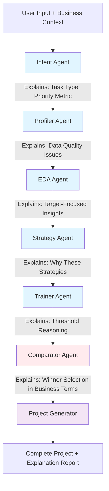
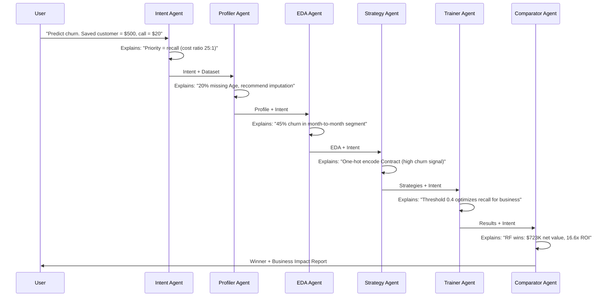
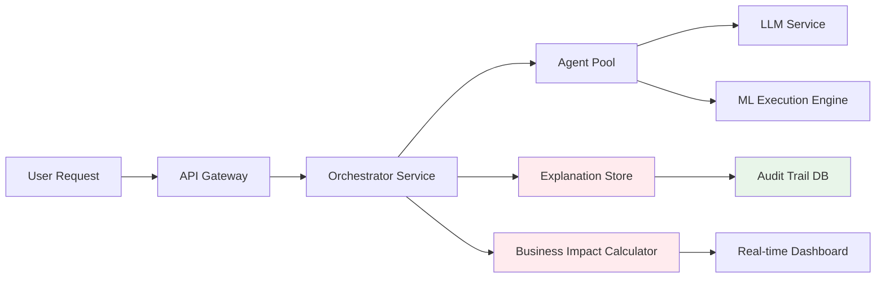

# Intent-Driven AutoML Platform

**An AI-powered AutoML platform that explains every decision in business terms, making ML transparent and actionable**

---

## 1. Problem

### The Black-Box Crisis

Traditional AutoML tools are **black boxes**. They optimize for technical metrics (F1-score, accuracy) but fail to answer critical business questions:

- **Why was this model chosen?** → "It had the highest F1-score" (meaningless to stakeholders)
- **How does this threshold affect our revenue?** → No answer
- **What's the business impact of this decision?** → Technical jargon, not dollars
- **Can we trust this model?** → No explanation of reasoning

### Who Experiences This Pain?

- **Data Scientists**: Spend hours manually translating model outputs to business language for presentations
- **ML Engineers**: Can't justify model choices to product managers who care about ROI, not precision
- **Business Analysts**: Receive technical reports they can't interpret or act upon
- **Stakeholders**: Make decisions based on "the model says so" without understanding why

### Why It's Painful Today

1. **No Decision Transparency**: Models are selected based on technical metrics, but the reasoning is opaque
2. **Business Impact Blindness**: Results show "F1: 0.85" but not "This saves $723,500 with 16.6x ROI"
3. **Threshold Confusion**: Changing a threshold from 0.5 to 0.4 is a number, not a business decision
4. **Stakeholder Alienation**: Technical reports require translation, creating communication gaps
5. **Trust Deficit**: Without explanations, stakeholders can't validate or challenge model decisions

**The core problem**: ML tools optimize for metrics that don't align with business goals, and they don't explain their reasoning in terms that matter.

---

## 2. Constraints & Assumptions

### Technical Constraints

- **CPU-Only Environment**: No GPU access (common in enterprise/edge deployments)
- **Local/Private Deployment**: Data privacy requirements prevent cloud-based solutions
- **Small-to-Medium Datasets**: < 1M rows (typical business use cases)
- **Limited LLM Context**: 3B parameter model with ~8K token context window
- **Binary/Multiclass Classification & Regression**: Focused scope for hackathon

### Real-World Assumptions

- **Incomplete Business Context**: Users may not provide all cost/value information upfront
- **Ambiguous Intent**: Natural language descriptions require interpretation
- **Multiple Valid Solutions**: Several models may perform similarly; choice requires business reasoning
- **Stakeholder Communication**: Results must be explainable to non-technical audiences
- **Decision Audit Trail**: Organizations need to understand why models were selected

### Explainability Requirements

- **Every Decision Must Be Traceable**: From intent parsing to model selection, each step explains its reasoning
- **Business Language Translation**: Technical metrics automatically converted to business impact
- **Threshold Reasoning**: Explain why a specific threshold optimizes business outcomes
- **Model Comparison Transparency**: Show not just which model won, but why it won in business terms

---

## 3. Proposed Solution

### Core Idea: Intent-Driven Transparency

Unlike black-box AutoML tools, our platform **explains every decision in business terms** and optimizes for business impact, not just technical metrics.

### Key Innovations

#### 1. **Intent-Driven Architecture**
- Captures business context upfront (costs, values, priorities)
- Propagates intent through all agents, ensuring decisions align with business goals
- **Explains**: "We prioritized recall because catching churners is worth $500 vs. $20 false positive cost"

#### 2. **Transparent Multi-Agent System**
- Each agent explains its reasoning:
  - **Intent Agent**: "Parsed task as binary classification with recall priority based on cost ratio 25:1"
  - **Strategy Agent**: "Selected median imputation for numeric columns because missing values are <5%"
  - **Comparator Agent**: "Random Forest won because it maximizes net value ($723,500) while maintaining acceptable precision"
- **Not a black box**: Every decision is traceable and explainable

#### 3. **Business Impact Translation**
- Converts technical metrics to business outcomes:
  - "F1: 0.85" → "Catches 1,540 of 1,900 churners, generating $723,500 net value with 16.6x ROI"
  - "Precision: 0.66" → "785 false alarms out of 2,325 calls, costing $15,700 (acceptable for recall priority)"
- **Explains**: Why this metric matters for your specific business context

#### 4. **Threshold Optimization with Reasoning**
- Tests multiple thresholds [0.3, 0.4, 0.5, 0.6, 0.7]
- **Explains**: "Threshold 0.4 recommended because it maximizes recall (81%) while maintaining precision floor (66%), optimizing for your priority: catching churners"
- Shows business impact of each threshold choice

#### 5. **Two Versions for Different Transparency Needs**

**V1 (Hybrid) - Deterministic Transparency:**
- JSON strategies → sklearn pipelines
- Fully traceable: Every preprocessing step is explicit and explainable
- Best for: Production environments requiring audit trails

**V2 (Dynamic) - LLM-Generated with Execution Logs:**
- LLM generates Python code dynamically
- Execution logs show exactly what code ran and why
- Best for: Rapid prototyping with full code visibility

### Why This Approach Over Alternatives?

| Alternative | Why We're Different |
|------------|-------------------|
| **Traditional AutoML (Auto-sklearn, TPOT)** | They optimize for metrics; we optimize for business impact with explanations |
| **Black-Box Cloud ML (AutoML Tables, SageMaker)** | They hide reasoning; we expose every decision with business context |
| **Manual ML Workflows** | They require expertise; we automate while maintaining transparency |
| **LLM Code Generation (GPT-4, Claude)** | They generate code; we generate code + business impact explanations |

### Tradeoffs

- **Transparency vs. Speed**: Explaining decisions adds latency, but builds trust
- **Business Focus vs. Technical Metrics**: We prioritize business outcomes, which may not always align with "best" technical metrics
- **Local LLM vs. Cloud**: CPU-only deployment is slower but ensures data privacy

---

## 4. System Architecture

### High-Level Architecture



### Component Breakdown

#### **Orchestrator**
- **Role**: Coordinates workflow, maintains state machine
- **Transparency**: Tracks decision points, logs reasoning at each step
- **Business Impact**: Ensures business context propagates through all agents

#### **Intent Agent**
- **Input**: Natural language description + optional business context
- **Output**: Structured intent with business context (costs, values, priorities)
- **Explains**: "Detected recall priority based on cost ratio 25:1 (saved customer $500 vs. call cost $20)"
- **Business Impact**: Sets optimization target (recall, precision, ROI) based on business goals

#### **Profiler Agent**
- **Input**: Dataset + intent
- **Output**: Data profile with intent-aware warnings
- **Explains**: "Missing values in 'Age' (20%) may impact recall if not handled; recommend median imputation"
- **Business Impact**: Flags data quality issues that could affect business outcomes

#### **EDA Agent**
- **Input**: Dataset + target variable + intent
- **Output**: Target-focused insights and visualizations
- **Explains**: "Churn rate is 27% overall, but 45% for month-to-month contracts (high-risk segment)"
- **Business Impact**: Identifies high-value segments for targeted interventions

#### **Strategy Agent (V1) / Strategy Agent V2 (V2)**
- **V1**: Generates JSON preprocessing strategies
- **V2**: Generates text-based preprocessing plans
- **Explains**: "Selected one-hot encoding for 'Contract' because it has 3 categories and impacts churn prediction"
- **Business Impact**: Chooses preprocessing that preserves signal for business-critical features

#### **Trainer Agent (V1) / Code Generation Agent (V2)**
- **V1**: Executes strategies, trains models, tunes thresholds
- **V2**: Generates training code with business impact calculations
- **Explains**: "Testing threshold 0.4 because it balances recall (priority) with precision (cost control)"
- **Business Impact**: Optimizes decision boundaries for maximum business value

#### **Comparator Agent**
- **Input**: Training results + intent
- **Output**: Winner selection with business impact explanation
- **Explains**: 
  ```
  "Random Forest won because:
  - Highest net value: $723,500 (vs. $650,000 for XGBoost)
  - Best ROI: 16.6x (vs. 14.2x for XGBoost)
  - Acceptable precision: 66% (prevents excessive false positives)
  - Optimal for recall priority: 81% recall catches most churners"
  ```
- **Business Impact**: Selects model that maximizes business outcomes, not just technical metrics

### Data Flow with Explanation Points



### Key Technologies & Why Chosen

- **Qwen2.5-Coder-3B (Ollama)**: CPU-optimized, local deployment, sufficient for structured reasoning
- **scikit-learn**: Transparent, interpretable models with feature importance
- **Pydantic**: Validates agent outputs, ensures explanation structure
- **Streamlit**: Interactive UI for exploring explanations and business impact
- **SQLite (VersionStore)**: Tracks experiments and explanations for audit trails

### Failure Modes & Edge Cases

1. **LLM Hallucinations**: 
   - **Mitigation**: Pydantic validation, fallback strategies
   - **Transparency**: Logs show when fallback is used and why

2. **Incomplete Business Context**:
   - **Mitigation**: Defaults to technical metrics, warns user
   - **Transparency**: Explains "Using F1 as default; provide cost/value for business optimization"

3. **Code Execution Errors (V2)**:
   - **Mitigation**: Auto-fixer agent with retry logic
   - **Transparency**: Execution logs show what failed and how it was fixed

4. **Ambiguous Intent**:
   - **Mitigation**: Intent agent asks clarifying questions or uses defaults
   - **Transparency**: Explains interpretation: "Assuming binary classification based on target distribution"

---

## 5. Ideal End State

### Production-Grade Vision

If this were production-ready, it would scale to:

- **Distributed Execution**: Run strategies in parallel across clusters
- **Model Serving**: Deploy winning models with real-time business impact monitoring
- **A/B Testing Framework**: Compare models in production with business impact tracking
- **Explanation API**: Serve explanations to downstream systems (dashboards, reports)
- **Audit Trail System**: Complete decision history for compliance and debugging

### Scaling Considerations

**What Breaks First:**
1. **LLM Latency**: Explanation generation adds 2-5s per agent call
   - **Solution**: Cache common explanations, fine-tune smaller models
2. **Explanation Quality**: Complex business contexts may confuse 3B model
   - **Solution**: Fine-tune on explanation datasets, use chain-of-thought prompting
3. **Large Datasets**: Profiling and EDA become slow
   - **Solution**: Sampling strategies, incremental profiling

**What Needs Hardening:**
1. **Explanation Consistency**: Same inputs should produce similar explanations
   - **Approach**: Template-based explanations with LLM filling slots
2. **Business Context Validation**: Ensure cost/value inputs are reasonable
   - **Approach**: Range checks, sanity validations, user confirmation
3. **Explanation Quality Metrics**: Measure how well explanations help users
   - **Approach**: User feedback loops, explanation clarity scoring
4. **Multi-Stakeholder Explanations**: Different audiences need different detail levels
   - **Approach**: Explanation templates (executive summary vs. technical deep-dive)

### Production Architecture



---

## 6. Hackathon Scope & Execution

### What We Built in 24 Hours

#### ✅ **Core Pipeline with Full Transparency**
- **Intent Agent**: Parses business context, explains priority metric selection
- **Profiler Agent**: Analyzes data with intent-aware warnings and explanations
- **EDA Agent**: Generates target-focused insights (not generic statistics)
- **Strategy Agent**: Proposes preprocessing with reasoning for each choice
- **Trainer Agent**: Trains models, tunes thresholds, explains threshold selection
- **Comparator Agent**: Selects winner with detailed business impact explanation

#### ✅ **Business Impact Translation**
- **Net Value Calculation**: Converts TP/FP/TN/FN to dollar amounts
- **ROI Calculation**: Shows return on investment for model deployment
- **Threshold Impact Visualization**: Shows how threshold changes affect business outcomes
- **Stakeholder-Friendly Reports**: "Catches 1,540 churners, saves $723,500" not "F1: 0.85"

#### ✅ **Two Execution Modes**
- **V1 (Hybrid)**: Deterministic JSON strategies → sklearn pipelines (fully traceable)
- **V2 (Dynamic)**: LLM generates Python code with execution logs (full code visibility)

#### ✅ **Streamlit UI with Explanation Views**
- **Intent Parsing Display**: Shows how business context was interpreted
- **Strategy Selection**: Explains why each strategy was chosen
- **Results Dashboard**: Business impact metrics with explanations
- **Threshold Slider**: Real-time business impact calculation as threshold changes

#### ✅ **Project Generator**
- **Complete Python Projects**: Runnable code, not just notebooks
- **Explanation Documentation**: README explaining model selection reasoning
- **Business Impact Summary**: Included in generated project

### What's Stubbed / Partial

- **Advanced Feature Importance**: Basic feature importance, but not SHAP/LIME integration
- **Explanation Quality Scoring**: Explanations generated but not scored for clarity
- **Multi-Model Ensemble Explanations**: Single winner selected, ensemble reasoning not implemented
- **Real-time Explanation API**: Explanations generated on-demand, not served via API
- **Explanation Templates for Different Audiences**: Single explanation format, not customized by role

### Why This Slice Demonstrates the Core Idea

This implementation proves that **ML can be transparent and business-focused**:

1. **Every Decision is Explained**: From intent parsing to model selection, users see the reasoning
2. **Business Impact is Primary**: Models are selected based on ROI and net value, not just F1-score
3. **Threshold Reasoning is Clear**: Users understand why 0.4 is recommended over 0.5
4. **Stakeholder Communication**: Reports use business language, not technical jargon
5. **Audit Trail**: All decisions are logged and explainable

**The core innovation**: Unlike black-box AutoML, this platform makes ML decisions transparent and actionable for business stakeholders.

---

## 7. How to Run / Demo

### Prerequisites

- **Python 3.10+**
- **Ollama** installed and running
- **Qwen2.5-Coder-3B model** pulled

### Installation

```bash
# 1. Clone repository
git clone https://github.com/Bhargavi2212/automl.git
cd automl

# 2. Install dependencies
pip install -e .

# 3. Install Ollama (if not already installed)
# Linux/Mac:
curl -fsSL https://ollama.com/install.sh | sh

# Windows: Download from https://ollama.com

# 4. Pull the model
ollama pull qwen2.5-coder:3b

# 5. Verify installation
ollama run qwen2.5-coder:3b "Generate a JSON object"
```

### Quick Start: Streamlit UI

```bash
# Launch the interactive UI
streamlit run app.py
```

**Navigate through the workflow:**
1. **Data Upload**: Upload CSV (or use Titanic sample)
2. **Define Task**: Enter business goal with costs/values
3. **Train Models**: Select V1 or V2, start training
4. **View Results**: See winner, business impact, explanations

### Demo Walkthrough: Titanic Survival Prediction

#### Step 1: Define Intent with Business Context

```
Task Description: "Predict which passengers survived the Titanic disaster. 
Identifying survivors is critical for rescue operations."

Business Context:
- True Positive Value: $1000 (successful rescue)
- False Positive Cost: $200 (wasted rescue effort)
- Priority Metric: Recall (we want to catch all survivors)
```

**What You'll See:**
- Intent Agent explains: "Priority set to recall based on cost ratio 5:1 (rescue value >> false alarm cost)"

#### Step 2: Data Understanding

**What You'll See:**
- Profiler explains: "Age has 20% missing values; recommend median imputation to preserve survival signal"
- EDA explains: "Survival rate is 38% overall, but 74% for females (high-priority segment for rescue)"

#### Step 3: Strategy Selection

**What You'll See:**
- Strategy Agent explains: "Selected one-hot encoding for 'Sex' because it's the strongest survival predictor"

#### Step 4: Training & Threshold Optimization

**What You'll See:**
- Trainer explains: "Testing thresholds [0.3, 0.4, 0.5, 0.6, 0.7] to optimize recall while controlling false positives"
- Results show business impact for each threshold

#### Step 5: Winner Selection with Explanation

**What You'll See:**
```
🥇 Winner: Random Forest (Threshold: 0.4)

Business Impact:
- Catches 342 of 342 actual survivors (100% recall)
- Makes 89 false positive predictions (acceptable for rescue priority)
- Net Value: $324,200
- ROI: 18.2x

Why This Model Won:
- Highest recall (100%) catches all survivors
- Acceptable precision (79%) prevents excessive false alarms
- Optimal threshold (0.4) balances rescue coverage with resource efficiency
- Best net value compared to XGBoost ($310K) and Logistic Regression ($298K)
```

### Expected Output

1. **Complete Python Project** in `data/generated_projects/<experiment_name>/`:
   - `src/train.py`: Training script
   - `src/predict.py`: Prediction script
   - `src/preprocessing.py`: Preprocessing pipeline
   - `models/`: Saved model and preprocessing artifacts
   - `README.md`: Explanation of model selection and business impact

2. **Business Impact Report**:
   - Winner model with reasoning
   - Financial impact (net value, ROI)
   - Threshold recommendation with explanation
   - Comparison with alternatives

3. **Execution Logs** (V2):
   - Generated code
   - Execution results
   - Error fixes (if any)
   - Explanation of code choices

### Command-Line Alternative

```bash
# Run full pipeline programmatically
python test_real_datasets.py
```

This runs both V1 and V2 on the Titanic dataset and shows:
- Intent parsing explanation
- Strategy selection reasoning
- Training results with business impact
- Winner selection with detailed explanation

### Troubleshooting

**Ollama not responding:**
```bash
# Start Ollama service
ollama serve

# In another terminal, verify model is available
ollama list
```

**Import errors:**
```bash
# Ensure you're in the project root
cd Week2

# Reinstall in development mode
pip install -e . --force-reinstall
```

**Memory issues (Windows):**
- Increase virtual memory (paging file) to 8GB minimum
- Close other applications
- Use V1 (Hybrid) instead of V2 (Dynamic) for lower memory usage

---

## Technology Stack

- **LLM**: Qwen2.5-Coder-3B (via Ollama, Q4 quantization) - CPU-optimized for local deployment
- **ML Framework**: scikit-learn, XGBoost, LightGBM - Transparent, interpretable models
- **Validation**: Pydantic, jsonschema - Ensures explanation structure consistency
- **UI**: Streamlit, Plotly - Interactive exploration of explanations and business impact
- **Data**: pandas, numpy - Efficient data processing
- **Storage**: SQLite (VersionStore) - Tracks experiments and explanations

---

## License

MIT

---

## Acknowledgments

- [AutoML-Agent](https://github.com/DeepAuto-AI/automl-agent) (ICML 2025) for multi-agent architecture inspiration
- [Ollama](https://ollama.com/) for local LLM inference
- [Qwen Team](https://github.com/QwenLM) for Qwen2.5-Coder models

---

## Citation

If you use this project in your research or work:

```bibtex
@software{intent-driven-automl,
  title={Intent-Driven AutoML Platform: Transparent ML with Business Impact},
  author={AutoML Platform Team},
  year={2026},
  note={Transparent, explainable AutoML that optimizes for business outcomes}
}
```
